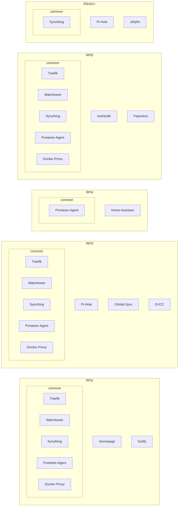

# Homelab

```mermaid

flowchart LR

  subgraph RPi2
    Homepage
    Gotify
    subgraph common-rpi2[common]
      traefik-rpi2[Traefik]
      watchtower-rpi2[Watchtower]
      syncthing-rpi2[Syncthing]
      portainer-rpi2[Portainer-Agent]
      dockerproxy-rpi2[Docker-Proxy]
    end
  end

  subgraph RPi3
    Pi-Hole
    Orbital-Sync
    EVCC
    subgraph common-rpi3[common]
      traefik-rpi3[Traefik]
      watchtower-rpi3[Watchtower]
      syncthing-rpi3[Syncthing]
      portainer-rpi3[Portainer-Agent]
      dockerproxy-rpi3[Docker-Proxy]
    end
  end

  subgraph RPi4
    ha[Home Assistant]
    subgraph common-rpi4[common]
      portainer-rpi4[Portainer-Agent]
    end
  end

  subgraph RPi5
    Authentik
    Paperless
    
    subgraph common-rpi5[common]
      traefik-rpi5[Traefik]
      watchtower-rpi5[Watchtower]
      syncthing-rpi5[Syncthing]
      portainer-rpi5[Portainer-Agent]
      dockerproxy-rpi5[Docker-Proxy]
    end
  end

  subgraph RS422+
    secondary-pihole[Pi-Hole]
    Jellyfin
    subgraph common-rs422[common]
      syncthing[Syncthing]
    end
  end

```

