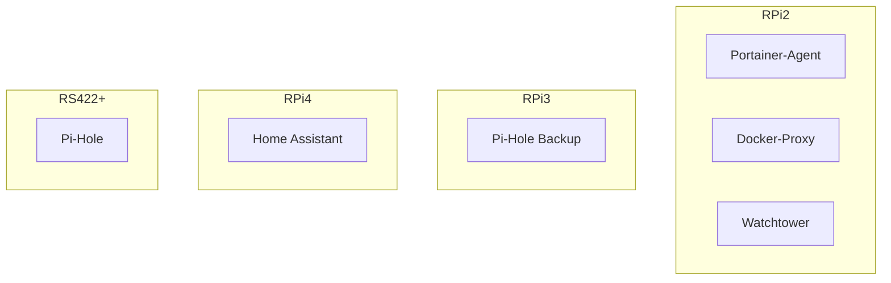

# Homelab

```mermaid

flowchart TD

  subgraph RPi2
    Portainer-Agent
    Docker-Proxy
    Watchtower
  end

  subgraph RPi3
    pihole2[Pi-Hole Backup]
  end

  subgraph RPi4
    ha[Home Assistant]
  end

  subgraph RS422+
    Pi-Hole
  end

```

