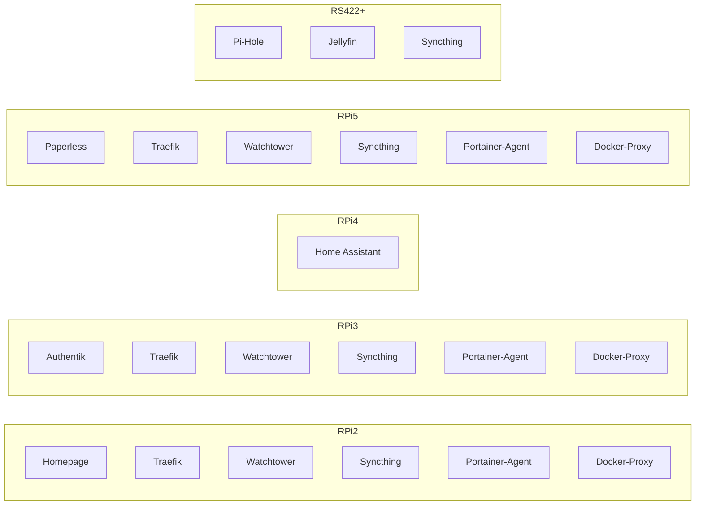

# Homelab

```mermaid

flowchart LR

  subgraph RPi2
    Homepage
    traefik-rpi2[Traefik]
    watchtower-rpi2[Watchtower]
    syncthing-rpi2[Syncthing]
    portainer-rpi2[Portainer-Agent]
    pockerproxy-rpi2[Docker-Proxy]
  end

  subgraph RPi3
    Authentik
    traefik-rpi3[Traefik]
    watchtower-rpi3[Watchtower]
    syncthing-rpi3[Syncthing]
    portainer-rpi3[Portainer-Agent]
    pockerproxy-rpi3[Docker-Proxy]
  end

  subgraph RPi4
    ha[Home Assistant]
  end

  subgraph RPi5
    Paperless
    traefik-rpi5[Traefik]
    watchtower-rpi5[Watchtower]
    syncthing-rpi5[Syncthing]
    portainer-rpi5[Portainer-Agent]
    pockerproxy-rpi5[Docker-Proxy]
  end

  subgraph RS422+
    Pi-Hole
    Jellyfin
    syncthing[Syncthing]
  end

```

