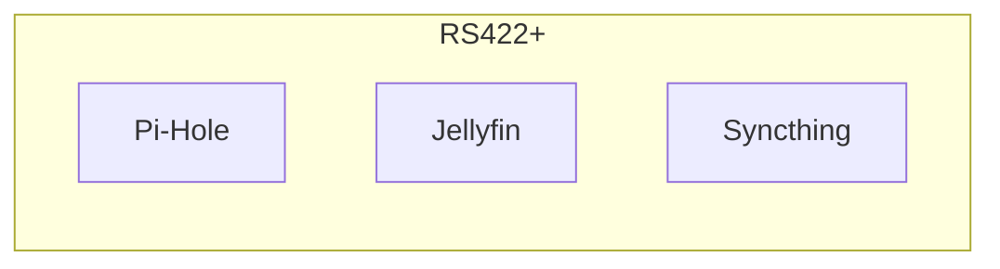
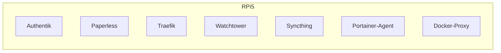
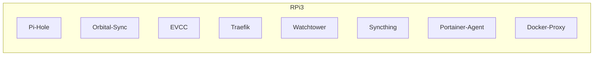
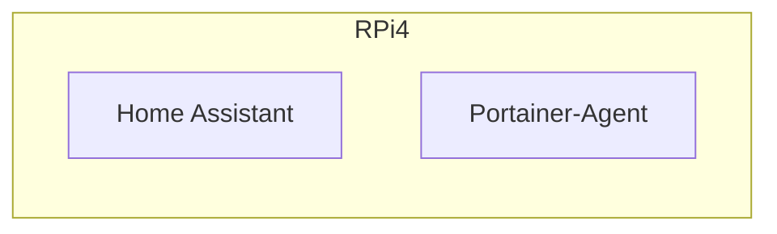
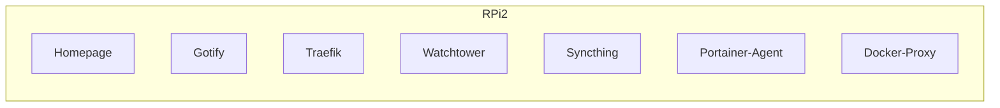
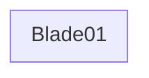
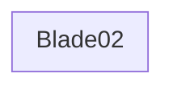

# Homelab

## Topology

This describes the services in my homelab.

<details><summary>RS422+</summary>



</details>

<details><summary>RPi5</summary>



</details>

<details><summary>RPi3</summary>



</details>

<details><summary>RPi4</summary>
  



</details>

<details><summary>RPi2</summary>
  


</details>

<details><summary>Blade01</summary>
  


</details>

<details><summary>Blade02</summary>
  


</details>

## SSH Setup

Generate SSH key on local machine:

```sh
ssh-keygen
```

Copy key over to remote machine:

```sh
ssh-copy-id -i <secret.pub> <user>@<ip>
```

Add the key to the local ssh `config` file:

```sh
echo "Host <ip>\n  IdentityFile ~/.ssh/<secret>" >> ~/.ssh/config
```
