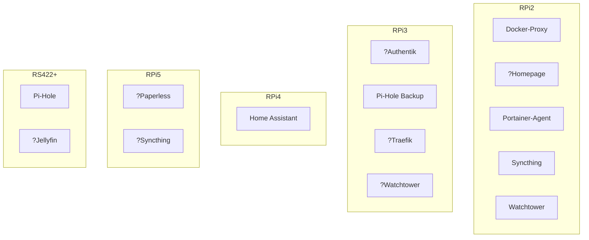

# Homelab

```mermaid

flowchart TD

  subgraph RPi2
    Docker-Proxy
    ?Homepage
    Portainer-Agent
    Syncthing
    Watchtower
  end

  subgraph RPi3
    ?Authentik
    pihole2[Pi-Hole Backup]
    ?Traefik
    ?Watchtower
  end

  subgraph RPi4
    ha[Home Assistant]
  end

  subgraph RPi5
    ?Paperless
    ?Syncthing
    ?Watchtower
  end

  subgraph RS422+
    Pi-Hole
    ?Jellyfin
    Syncthing
  end

```

